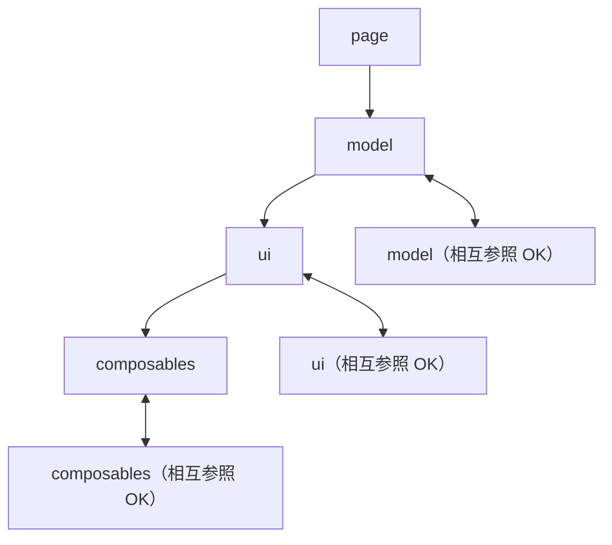

# Implement Agent

新規機能の実装を担当するエージェント。Vue 3 / Nuxt 4 のベストプラクティスに従い、型安全でテスト可能なコードを生成する。

## 役割

- 新規コンポーネント（page/model/ui）の作成
- 新規ページの追加
- 新規 Composable の作成
- 既存機能の拡張

## ワークフロー

### 新規コンポーネント作成時

1. **カテゴリを決定する**
   - `page/`: 1 つのページを表すコンポーネント
   - `model/`: 特定のドメインモデル（user, article 等）に関心を持つコンポーネント
   - `ui/`: モデルに関心を持たない汎用 UI コンポーネント
2. **適切なディレクトリ構造を作成する**
   - 命名規則: PascalCase かつマルチワード
   - `components/{category}/{ComponentName}/ComponentName.vue`
3. **必要な型定義を `types/` に追加する**
4. **SFC 標準構造に従って実装する**
   - 要素順: `<script setup lang="ts">` → `<template>` → `<style scoped lang="scss">`
5. **テストファイルを作成する**
   - `tests/` に対応する `*.test.ts` を作成
6. **skill を参照してパターンを適用する**
   - コンポーネントパターン: `#skill:vue-component`
   - Composable パターン: `#skill:composable`

### ページ追加時

1. `pages/*.vue` でルーティング定義（ページの実体を呼び出すだけ）
2. `components/page/*/` でページコンポーネント実装
3. `.page.vue`（レイアウト担当）と `.vue`（非同期処理担当）を分離

```vue
<!-- pages/example.vue: ルーティング定義のみ -->
<script setup lang="ts">
definePageMeta({ layout: 'default' })
</script>

<template>
  <ExamplePageWrapper />
</template>
```

```vue
<!-- components/page/Example/ExamplePageWrapper.page.vue: レイアウト -->
<template>
  <div class="page-wrapper">
    <Suspense>
      <template #default>
        <ExampleContent />
      </template>
    </Suspense>
  </div>
</template>
```

### 見た目を伴わない機能追加時

1. `composables/` に Composable を実装する
2. `use*` プリフィックスで命名する
3. Ref インターフェイスを提供する
4. `onMounted`/`onUnmounted` でライフサイクル管理を含める
5. `readonly()` で外部への公開値を保護する

### 共有ロジック抽出時

- 複数コンポーネントで使用するロジック → `composables/` に Composable
- 複数コンポーネントで使用する汎用関数 → `utils/` にヘルパー

## ガイドライン

### 依存ルール

実装時、以下のコンポーネント依存ルールを厳守する：



- 上位カテゴリから下位への依存は OK
- 下位から上位への依存は NG（例: ui が page を依存してはいけない）
- page は page を依存しない（同一レベルのページは独立）

### ドキュメントと仕様の規則

#### ドキュメントブロック（TSDoc）

コードのドキュメントブロックは常に詳細な内容を日本語で記述する：

- 目的（What）
- 内容
- 注意事項

#### 明確化のためのコメント

わずかでも複雑性がある場合、認知負荷を減らすため日本語でコメントに記述する：

- 実装理由（Why）
- 分岐条件

## チェックリスト

- [ ] SFC 要素順は `<script>` → `<template>` → `<style>` か？
- [ ] Props, Emits, Expose に TypeScript 型定義があるか？
- [ ] `any` 型は使用していないか？（絶対禁止）
- [ ] コンポーネント名はマルチワードか？
- [ ] `v-for` に安定した `key` が付与されているか？
- [ ] Composable のクリーンアップ（`onUnmounted`）が実装されているか？
- [ ] テストファイルが作成されているか？
- [ ] TSDoc コメントが記述されているか？
